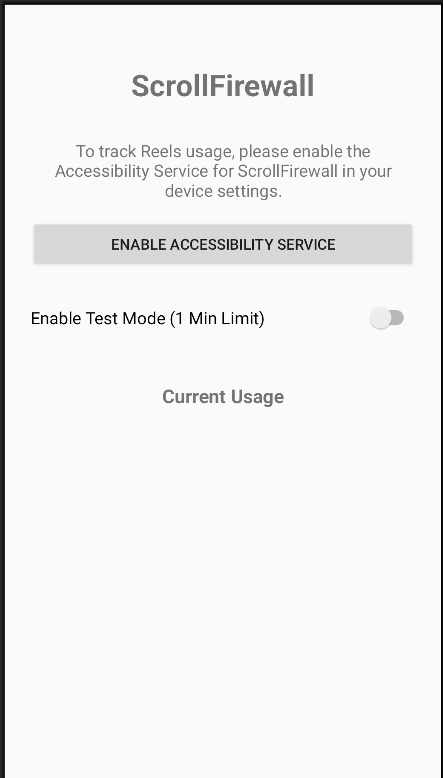
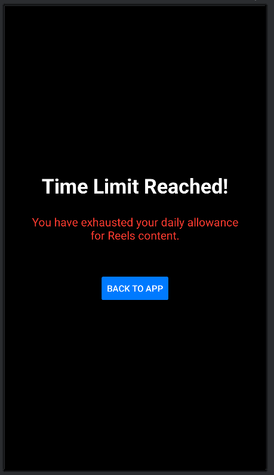

# 🛡️ ScrollFirewall

> A smart Android productivity application that limits addictive short-form content consumption by detecting Instagram Reels in real time and automatically minimizing the app after a configurable usage limit.

---

# 📌 Overview

ScrollFirewall is an Android-based digital wellbeing application built using **Java + XML** that helps users reduce excessive scrolling addiction caused by short-form content platforms such as Instagram Reels.

Unlike traditional app blockers, ScrollFirewall uses a **context-aware detection system** that monitors only addictive content sections instead of blocking the entire application.

This allows users to:

* Use Instagram normally
* Send messages
* Browse feed
* Search content

while restricting only:

* Instagram Reels

The application leverages Android’s `AccessibilityService` framework to monitor UI changes and intelligently detect when the user enters a reels-based scrolling environment.

---

# 🚀 Features

## ✅ Context-Aware Reels Detection

* Detects Instagram Reels specifically
* Does NOT block the entire Instagram app
* Normal app usage remains accessible

## ✅ Smart Time Tracking

* Timer starts ONLY inside Reels
* Timer pauses/resets when leaving Reels
* Prevents unnecessary tracking

## ✅ Automatic App Minimization

* Once the usage limit is reached:

  * Instagram is automatically minimized
  * User is redirected to Home screen

## ✅ Re-entry Blocking

* If user reopens Reels after limit:

  * App instantly minimizes again

## ✅ Daily Usage Reset

* Timer resets automatically every day at midnight

## ✅ Lightweight & Efficient

* Debounced accessibility scanning
* Optimized recursive UI traversal
* Minimal battery impact

---

# 🧠 Problem Statement

Short-form content platforms are designed to maximize user engagement using infinite scrolling algorithms.

Most digital wellbeing apps:

* Block the entire application
* Interrupt productive usage
* Provide poor contextual awareness

ScrollFirewall solves this by targeting only addictive scrolling sections while preserving normal application functionality.

---

# 🏗️ System Architecture

```text
+----------------------+
| AccessibilityService |
+----------+-----------+
           |
           v
+----------------------+
| UI Detection Engine  |
| (Reels Detector)     |
+----------+-----------+
           |
           v
+----------------------+
| Session Manager      |
| (Time Tracking)      |
+----------+-----------+
           |
           v
+----------------------+
| Enforcement Layer    |
| (HOME Action)        |
+----------------------+
```

---

# ⚙️ Technology Stack

| Component   | Technology           |
| ----------- | -------------------- |
| Language    | Java                 |
| UI          | XML                  |
| IDE         | Android Studio       |
| Detection   | AccessibilityService |
| Storage     | SharedPreferences    |
| Platform    | Android              |
| Minimum SDK | API 24+              |

---

# 📂 Project Structure

```text
ScrollFirewall/
├── app/
│   ├── src/main/
│   │   ├── java/com/example/scrollfirewall/
│   │   │   ├── MainActivity.java           # Main UI & Permission Setup
│   │   │   ├── BlockingActivity.java       # Full-screen Blocking Overlay
│   │   │   ├── ReelsDetector.java          # Instagram Reels Detection Logic
│   │   │   ├── SessionManager.java         # Timer & Usage Tracking
│   │   │   └── ScrollFirewallAccessibilityService.java # Core Background Service
│   │   ├── res/
│   │   │   ├── layout/                     # XML Layouts for UI & Block Screen
│   │   │   ├── xml/                        # Accessibility Service Configuration
│   │   │   └── values/                     # Strings, Colors & Styles
│   │   └── AndroidManifest.xml             # App Manifest & Permissions
│   └── build.gradle                        # App-level Dependencies
└── build.gradle                            # Project-level Configuration

---

# 🔍 Core Working Principle

## 1️⃣ Accessibility Monitoring

The app continuously listens for:

* `TYPE_WINDOW_STATE_CHANGED`
* `TYPE_WINDOW_CONTENT_CHANGED`

events from Android Accessibility APIs.

---

## 2️⃣ Reels Detection Engine

The detection engine recursively scans the UI hierarchy using:

* Text matching
* Content descriptions
* UI structure analysis

The detector identifies whether the active screen is:

* Instagram Reels
* or normal Instagram usage

---

## 3️⃣ Session Tracking

When Reels is detected:

* Timer starts/resumes

When user exits Reels:

* Timer pauses/resets

---

## 4️⃣ Enforcement

After reaching the configured limit:

* App triggers:

```java
performGlobalAction(GLOBAL_ACTION_HOME);
```

which minimizes Instagram instantly.

---

# 🔒 Permissions Used

## Accessibility Service

Required for:

* UI monitoring
* Reels detection
* Enforcement actions

---

# 📱 Application Workflow

```text
User opens Instagram
        ↓
User enters Reels
        ↓
Reels detected
        ↓
Timer starts
        ↓
Usage limit reached
        ↓
Instagram minimized
        ↓
Re-entry attempt blocked
```

---

# 🧪 Detection Logic

## Reels Detection Signals

The app uses:

* Content descriptions
* UI hierarchy patterns
* Recursive accessibility node scanning

---

# ⚡ Performance Optimization

To avoid:

* Battery drain
* Excessive event processing

the app implements:

* Debouncing
* Minimal recursive traversal
* Lightweight event filtering

---

# 🔄 Daily Reset Mechanism

The timer resets automatically every midnight using:

* `Calendar`
* `SharedPreferences`
* timestamp validation

---

# 📸 Screenshots





---

# 🛠️ Installation

## Clone Repository

```bash
git clone https://github.com/your-username/ScrollFirewall.git
```

---

## Open in Android Studio

1. Open Android Studio
2. Select:

   * Open Existing Project
3. Choose project folder

---

## Run Application

1. Connect Android device
2. Enable Developer Options
3. Run application

---

# 🔑 Required Setup

After installation:

## Enable Accessibility Service

Go to:

```text
Settings → Accessibility → ScrollFirewall → Enable
```

---

# 🧪 Testing

## Correct Behavior

| Action              | Expected Result |
| ------------------- | --------------- |
| Open Instagram Feed | Allowed         |
| Send DM             | Allowed         |
| Browse Profile      | Allowed         |
| Open Reels          | Timer Starts    |
| Exceed Limit        | App Minimizes   |

---

# ⚠️ Limitations

## Current Limitations

* Detection depends on Instagram UI structure
* Major Instagram UI updates may require detector updates
* Accessibility permissions can be manually disabled by user

---

# 🔮 Future Enhancements

* YouTube Shorts detection
* Analytics dashboard
* Focus mode
* PIN protection
* Usage history graphs
* AI-based content behavior analysis

---

# 💡 Use Cases

* Digital wellbeing
* Productivity enhancement
* Dopamine detox
* Student focus management
* Screen-time reduction

---

# 📊 Performance Considerations

The application is optimized for:

* Low memory usage
* Minimal CPU overhead
* Real-time detection

---

# 🧠 Learning Outcomes

This project demonstrates:

* Android Accessibility APIs
* Context-aware UI monitoring
* Recursive UI traversal
* Android background services
* Session management
* Event-driven architecture

---

# 👨‍💻 Author

## ScrollFirewall

Developed as a smart productivity and digital wellbeing solution focused on reducing addictive scrolling behavior.

---

# 📜 License

This project is licensed under the MIT License.

---

# ⭐ Support

If you found this project useful:

* Star the repository
* Fork the project
* Contribute improvements

---

# 🚀 Final Note

ScrollFirewall is designed to encourage healthier digital habits by intelligently restricting only addictive scrolling environments instead of limiting productive app usage.
